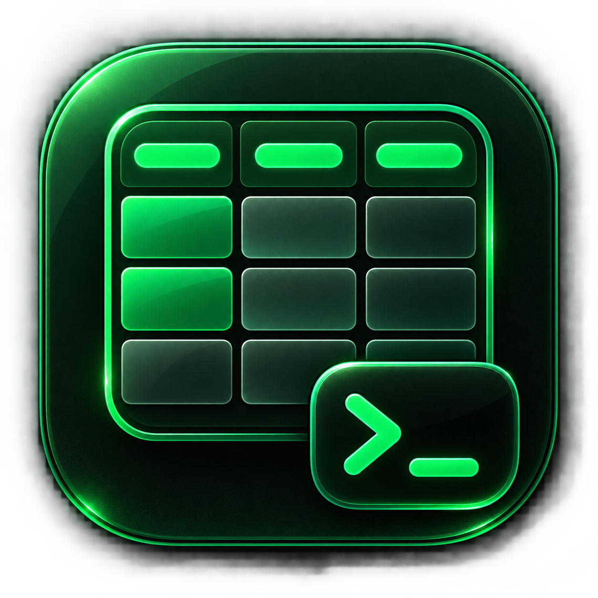

<p align="center">
  
</p>

<h1 align="center">Duc's Table</h1>

<p align="center">
  A privacy-first, local-first macOS SQL workspace for files and databases.
</p>

<p align="center">
  <a href="https://github.com/antonioducs/ducs-table/actions/workflows/ci.yml"></a>
  <a href="LICENSE"></a>
  
  
</p>

Duc's Table combines DuckDB, a virtualized grid, a CodeMirror SQL editor,
persistent project workspaces, and optional AI assistance. Explore and join CSV,
TSV, JSON, JSONL/NDJSON, XLSX, PostgreSQL, MongoDB, and local DuckDB data without
loading complete datasets into React or modifying the original sources.

> [!IMPORTANT]
> The project is in early `0.x` development. It currently supports native macOS
> source builds; no notarized public binary has been released yet.

## Why Duc's Table

- **Local by default:** imported data, snapshots, SQL, results, and project
  sessions stay in one local DuckDB workspace.
- **Read-only guardrails:** remote catalogs and user SQL are constrained to
  read-only exploration; original files and remote data are never modified.
- **Work with large data:** grids page, filter, sort, and export without copying
  full result sets into frontend state.
- **Live or offline:** inspect remote relations lazily or create atomic local
  snapshots for later work.
- **Federated SQL:** join local files, snapshots, PostgreSQL, and experimental
  MongoDB relations from one editor.
- **Persistent workbench:** projects retain sources, saved SQL, tabs, split
  groups, recent executions, and attached results between launches.
- **Explicit AI egress:** optional Codex or Claude assistance requires provider
  consent, and every bounded row preview requires separate approval.

## Data sources

| Source | Status | Behavior |
| --- | --- | --- |
| CSV, TSV | Stable | Imported into local DuckDB tables |
| JSON, JSONL/NDJSON | Stable | Imported locally; nested values are serialized |
| XLSX | Stable | Sheet selection; first use may download DuckDB's Excel extension |
| Local DuckDB | Stable | Durable local tables and materialized results |
| PostgreSQL | Stable | Read-only live relations and snapshots |
| MongoDB | Experimental | Read-only community extension with explicit consent |

PostgreSQL live pages push projection, stable ordering, `LIMIT`, and `OFFSET`
when possible. Primary/unique keys and MongoDB `_id` provide stable paging; the
UI warns when rows may shift because no stable key exists.

## Quickstart from source

Requirements:

- macOS on the architecture being built;
- Go 1.25 or newer;
- Node.js 22 or newer and npm;
- Xcode Command Line Tools; and
- Wails v2.15.x.

```sh
git clone https://github.com/antonioducs/ducs-table.git
cd ducs-table
npm ci
npm --prefix frontend ci
npm --prefix ai-sidecar ci
go install github.com/wailsapp/wails/v2/cmd/wails@v2.15.0
export PATH="$PATH:$(go env GOPATH)/bin"
npm run dev
```

Build a native development application:

```sh
npm run build
```

The app is written to `build/bin/ducs-table.app`. Local builds are ad hoc signed
unless `DUCS_CODESIGN_IDENTITY` is set; they are not equivalent to a notarized
public release. See [Development](docs/development.md) and
[Releasing](docs/releasing.md).

## Safety and privacy

The SQL editor accepts exactly one `SELECT` or `WITH` statement. DDL, DML,
attach/detach, install/load, secrets, filesystem and HTTP writes, and provider
escape hatches are rejected. Normal references to catalogs attached read-only by
the application remain available.

Passwords are stored exclusively in macOS Keychain. If Keychain is unavailable,
credential operations fail closed with no plaintext or encrypted-file fallback.
Passwords and credential-bearing URIs do not enter the workspace, frontend
state, events, or application logs.

Duc's Table has no app account, cloud backend, analytics, telemetry, or automatic
file upload. Network access occurs only for user-configured database connections,
first-use downloads of allowlisted DuckDB extensions, and optional AI provider
operations after consent.

Read the [privacy policy](PRIVACY.md), [security model](docs/security-model.md),
and [security reporting policy](SECURITY.md) before using sensitive data or
changing a security boundary.

## Optional AI assistant

AI is disabled until a provider is chosen and authenticated. Depending on an
approved request, a provider may receive the prompt, system instructions,
provider conversation context, project and schema metadata, sanitized connection
status, validated SQL, and separately approved preview rows.

Every row preview is limited to 100 rows, 256 KiB, and 10 seconds. The assistant
cannot receive database passwords or unrestricted database access, and
provider-native shell, filesystem, web, plugin, skill, and agent tools are
disabled.

Codex uses a personal ChatGPT/Codex login. Claude requires a compatible Claude
Code installation and personal Claude.ai authentication. Provider services and
the bundled Claude Agent SDK are governed by their own terms; see
[Third-party notices](THIRD_PARTY_NOTICES.md).

## Checks

```sh
gofmt -w <changed-go-files>
go vet ./...
go test ./...
npm run typecheck
npm run lint
npm run test:unit
npm run ai:build
npm run ai:test
npm run build
```

The standard suite is deterministic and requires no database, Docker, network,
or AI authentication. Live PostgreSQL and MongoDB integration tests are opt-in;
their setup is documented in [Development](docs/development.md).

## Documentation

- [Architecture](docs/architecture.md)
- [Security model](docs/security-model.md)
- [Development](docs/development.md)
- [Releasing](docs/releasing.md)
- [Privacy](PRIVACY.md)
- [Roadmap](ROADMAP.md)
- [Changelog](CHANGELOG.md)
- [Support](SUPPORT.md)

## Contributing

Contributions are welcome. Read [CONTRIBUTING.md](CONTRIBUTING.md), follow the
[Code of Conduct](CODE_OF_CONDUCT.md), and open an Issue before investing in a
large feature or architectural change. Suspected vulnerabilities must be
reported privately according to [SECURITY.md](SECURITY.md).

## License

Duc's Table source code is licensed under the
[Apache License 2.0](LICENSE). Compiled applications aggregate third-party
components under separate licenses or service terms, including the Claude Agent
SDK; consult [NOTICE](NOTICE) and
[THIRD_PARTY_NOTICES.md](THIRD_PARTY_NOTICES.md).
