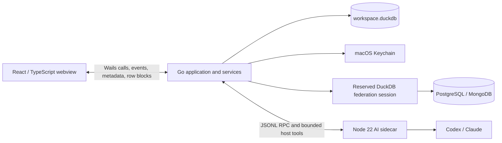

# Architecture

Duc's Table is a macOS desktop application built with Go 1.25, Wails v2, React/TypeScript, DuckDB, and an optional Node 22 AI sidecar. The design keeps file parsing, SQL, credentials, remote connections, exports, and AI policy enforcement outside the webview.



The frontend is a presentation and interaction layer, not a trust boundary. It sends IDs, user choices, SQL text, grid controls, and file-dialog actions through Wails. Go validates those requests and returns small metadata payloads or paged row blocks rather than entire datasets.

## Runtime components

### Wails host and Go services

`main.go` creates the Wails window and binds the deliberately small `App` surface. `app.go` owns lifecycle, composes services, translates Wails calls and events, coordinates background jobs, and shuts down the sidecar, connections, DuckDB, and log in order.

The backend is split by responsibility:

| Path | Responsibility |
| --- | --- |
| `internal/database` | DuckDB pool, connection initialization, migrations, startup cleanup, mutation serialization, quoting, and value serialization |
| `internal/workspace` | Projects, source metadata, saved SQL, connection links, and versioned workbench sessions |
| `internal/importers` | Validation and local materialization of CSV, TSV, JSON, JSONL/NDJSON, and XLSX |
| `internal/grid` | Validated projection, filtering, sorting, and paged row blocks for local and live resources |
| `internal/query` | Read-only SQL validation and transactional result materialization |
| `internal/export` | Full-resource or current-view CSV export through controlled backend SQL |
| `internal/jobs` | Bounded background work, progress, cancellation, and Wails update events |
| `internal/connections` | Global connection metadata, project links, schema browsing, live relations, and snapshots |
| `internal/federation` | One long-lived, serialized DuckDB connection holding extensions, secrets, and attached catalogs |
| `internal/extensions` | Fixed allowlist and installation/loading policy for `excel`, `postgres`, and experimental `mongo` |
| `internal/credentials` | macOS Keychain persistence and fail-closed credential access |
| `internal/ai` | Consent state, conversation repository, redaction, bounded tools, approvals, and sidecar supervision |
| `internal/apppaths`, `internal/applog` | Private application paths and bounded structured diagnostics |

### React frontend

`frontend/src` contains the React workbench, virtualized data grid, CodeMirror SQL editor, project and connection UI, optional AI panel, Wails bridge adapters, and Zustand stores. Durable project state is sent to the backend; only lightweight global layout preferences belong in browser storage.

The grid requests local pages or remote blocks as needed. A live remote view asks for 100 rows at a time and uses `LIMIT requested + 1` to discover whether another page exists without an automatic remote `COUNT(*)`.

### AI sidecar

`ai-sidecar/src` is a TypeScript JSONL-RPC process started lazily by the Go supervisor. It adapts Codex and Claude authentication, model discovery, streaming, cancellation, and tool calls. The Go host remains authoritative for project scope, consent, SQL validation, preview approval, limits, and redaction. Provider-native shell, filesystem, web, plugin, skill, and agent tools are disabled.

Production builds bundle the compiled sidecar, production dependencies, native provider packages, a matching Node runtime, launcher, license, and notices inside the app's resources. `scripts` stages, packages, signs, and verifies that bundle.

## Workspace and storage

The default local state is:

```text
~/Library/Application Support/Duc's Table/
├── workspace.duckdb
├── temp/
├── extensions/
├── ai/
└── app.log
```

`workspace.duckdb` has three important namespaces:

- `ducs_meta` holds migrations, projects, source records, snapshot origins, safe connection configuration and links, saved SQL, sessions, and AI conversation/settings metadata;
- `data` holds durable imported tables, snapshots, and query results explicitly saved as tables; and
- `result` holds ephemeral materialized query output.

Passwords do not live in this file. They are keyed by connection ID in macOS Keychain. Provider sessions and AI conversations use the local workspace/runtime directories as described in [PRIVACY.md](../PRIVACY.md).

## Data flows

### Import and materialization

1. The native dialog or file-drop handler supplies absolute file paths to Go.
2. The importer validates type and options; workbook sheet names are inspected locally.
3. A cancellable job creates a table transactionally in `data` and records project-scoped source metadata.
4. The frontend receives source metadata and then pages rows through the grid service.

Original files are not modified. Materialization uses local disk space to make later filtering, SQL, export, and restoration independent of the source file.

### SQL and results

1. `internal/query` accepts exactly one `SELECT` or `WITH` statement and rejects state-changing and escape operations.
2. The validated statement runs on the federated session so app-attached read-only catalogs can participate.
3. The backend wraps it in a controlled `CREATE TABLE ... AS SELECT` and atomically registers an ephemeral `result.__tmp_*` source.
4. The grid pages the materialized result. Saving it creates a durable `data` table; replacing or closing a query removes its ephemeral output.

Internal attach, extension, secret, snapshot, and result SQL is constructed only by backend services and does not pass through the user-SQL path.

### Connections, Live, and Snapshot

Connection configuration and credentials are global. A project stores a link to a connection; unlinking does not delete or disconnect it. Connected catalogs receive immutable normalized aliases and are attached read-only on the reserved federation session.

A **Live** resource keeps only discovered relation metadata locally and reads bounded blocks from the remote relation. PostgreSQL can push an unfiltered projection, stable order, limit, and offset to the server. Stable keys are used when available; otherwise paging is explicitly marked unstable.

A **Snapshot** copies the full relation to `data`, retains origin/refresh metadata, and works offline. Refresh builds a staging table and swaps it transactionally, preserving the previous version on cancellation or failure. Deleting a global connection preserves existing snapshots.

### Projects and sessions

Projects scope normal UI and service operations. Each stores saved SQL, query documents, tabs, editor groups, split layout, a bounded execution history, and result naming state. Connections remain global and are linked into projects.

All projects share one DuckDB file and the physical `data` and `result` schemas. Projects are organizational contexts, not access-control or data-isolation boundaries. See the [security model](security-model.md) for the consequence of that design.

## Trust boundaries

The critical boundaries are the Wails bridge, DuckDB user-SQL validator, Keychain adapter, fixed extension manager, remote database attachments, Go-to-sidecar JSONL RPC, and sidecar-to-provider network egress. Backend APIs prefer opaque source/relation IDs and resolve trusted metadata server-side; for example, grid and export calls do not accept an arbitrary external qualified name from the frontend.

Changes crossing any of these boundaries require negative tests and a review against [docs/security-model.md](security-model.md).
